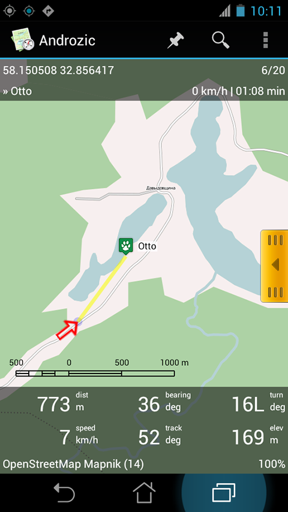
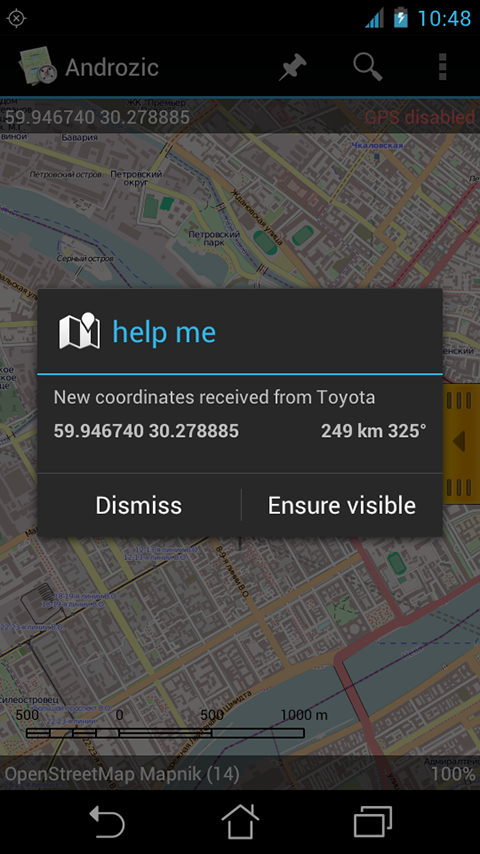
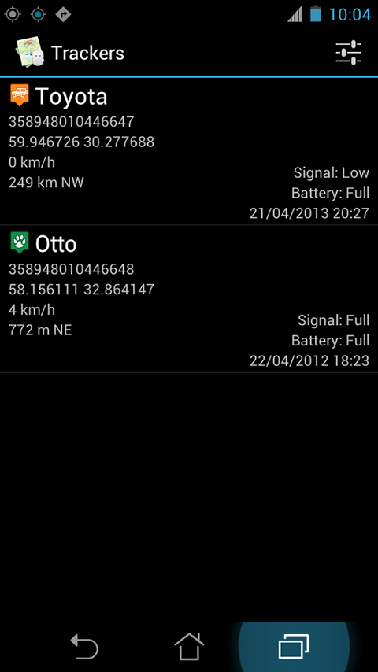

SMS GPS Tracker plugin for Androzic
===================================

Intersepts SMS messages from GPS trackers  and displays locations on Androzic map.

Currently supports:

 * [Jointech](http://joint-tracking.com/en/product_center/) JT600 tracker. May be it supports other Jointech trackes, but it is not tested.
 * [Xexun](http://www.xexun.com/Products.aspx) TK101, TK102, TK102-2, TK201, TK201-2 trackers. May be it supports other Xexun trackes and its many clones, but it is not tested.

